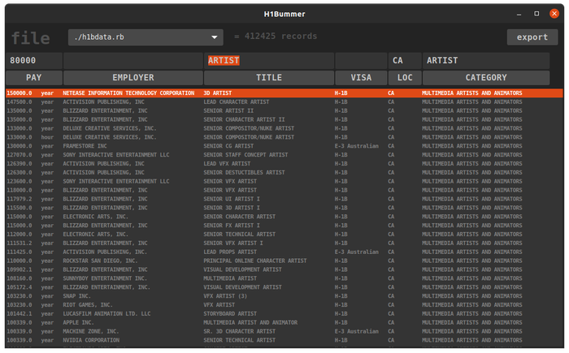

# h1bummer

H1B data ui

1. grab source data from [here](https://www.dol.gov/agencies/eta/foreign-labor/performance)
2. download [munge](http://www.dobeash.com/files/munge3.html) and [atronix rebol3](https://www.atronixengineering.com/downloads) to the same location as the xlsx file
3. convert the xlsx to native, use the .rb extension, eg:
```
./atronix-r3-latest
do %munge3.r
ctx-munge/export bind words-of ctx-munge 'self
d: load-xml %H-1B_Disclosure_Data_FY2019.xlsx
save %h1bdata.rb d
```
4. download h1bummer and [latest red](https://www.red-lang.org/p/download.html) to the same location
5. run `./red-latest h1bummer.red`

currently h1bummer is slow to load and filter, if it takes more than 20-seconds to do anything kill it and try with a smaller quarterly data set. 

export is visible items only, in semi-colon csv format

export saves to ./export.csv, *it will overwrite this file every time*, so rename if you want to keep it.

tested with Linux only. 

using default Gnome dark theme; it will look awful in other themes or in windows. hopefully a 100% draw based ui will solve this problem in future.

# screenie


# TODO
- [ ] fix pay filter
- [ ] clear list if filters yield 0 results
- [ ] add workplace address
- [ ] add panel for raw data per selected item
- [ ] grouped sorting (eg: sort by employer then by pay)
